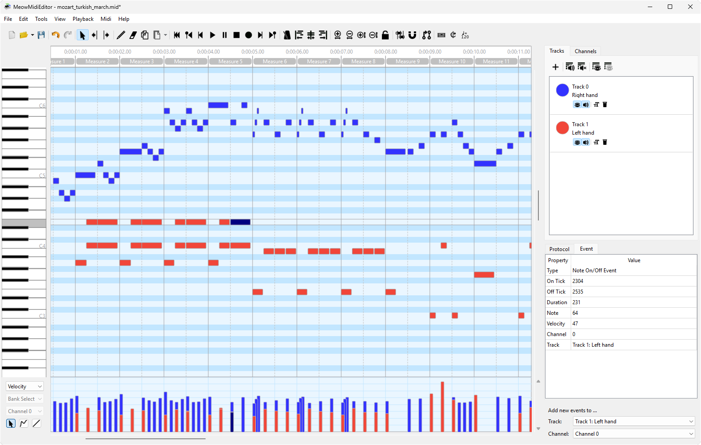

# ProMidEdit
------

Downloads : [latest release](https://github.com/Meowchestra/MidiEditor/releases)

### Introduction

ProMidEdit is a free software providing an interface to edit, record, and play midi data.

The editor is able to open existing midi files and modify their content. New files can be created and the user can enter his own composition by either recording Midi data from a connected Midi device (e.g., a digital piano or a keyboard) or by manually creating new notes and other Midi events. The recorded data can be easily quantified and edited afterwards using ProMidEdit.

### Features

* Easily edits, records and plays Midi files
* Can be connected to any Midi port (e.g., a digital piano or a synthesizer)
* Tracks, channels and Midi events can be edited
* Event quantization
* Control changes can be visualized
* Free
* Available for Windows

### Note

ProMidEdit was developed by PROPHESSOR based on [Markus Schwenk's MidiEditor](https://github.com/markusschwenk/midieditor). My personal fork of ProMidEdit is a custom build based on [jingkaimori's fork](https://github.com/jingkaimori/midieditor/) of [ProMidEdit](https://github.com/PROPHESSOR/ProMidEdit), built on top of [MidiEditor](https://github.com/markusschwenk/midieditor) with additional changes & merged pull-requests ahead of upstream.

### Original Project Page

[https://midieditor.org](https://midieditor.org)

### Manual

[https://Meowchestra.github.io/MidiEditor/](https://Meowchestra.github.io/MidiEditor/)
